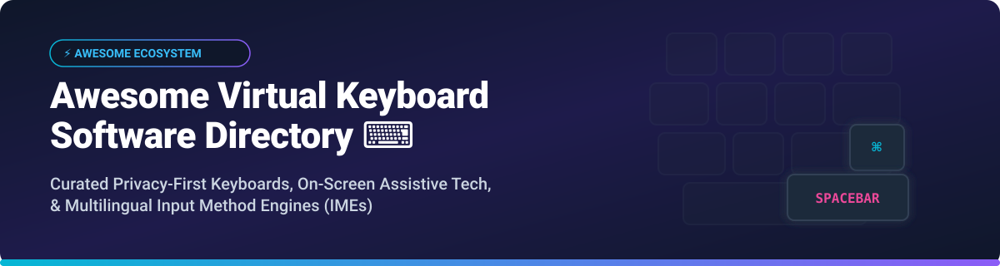

  

# ⌨️ Awesome Virtual Keyboard Software Ecosystem 🚀

A curated list of **Virtual Keyboard Software**, **on-screen keyboards**, **accessibility input tools**, and **privacy-first Android/desktop typing platforms**. 🌐📱🖥️

Whether you are looking for privacy-conscious Android keyboard replacements (zero-permission input methods), accessible desktop virtual keyboards for motor impairments, customizable layout engines, or enterprise writing assistant SDKs, this directory lists the best SaaS and open-source solutions. 💡⚡

> **SEO Keywords**: Virtual Keyboard Software, On-Screen Keyboard, Accessibility Input, Android Keyboard, Privacy Keyboard, Touchscreen Typing, Multilingual Input Method Engine (IME), AOSP Keyboard, F-Droid Keyboards. 🔍📊

---

## 📑 Table of Contents

- [📈 Market Size & Industry Dynamics](#-market-size--industry-dynamics)
- [💼 SaaS & Commercial Products](#-saas--commercial-products)
- [🔓 Open-Source GitHub Repositories](#-open-source-github-repositories)
- [🛠️ Frameworks & Custom Solutions](#%EF%B8%8F-frameworks--custom-solutions)
- [🤝 How to Contribute](#-how-to-contribute)
- [💖 Support & Sponsorship](#-support--sponsorship)
- [⭐ Star History](#-star-history)
- [⚠️ Disclaimer](#%EF%B8%8F-disclaimer)

---

## 📈 Market Size & Industry Dynamics

The global virtual keyboard and input method software market is estimated at **$2.5 Billion to $3.2 Billion**, driven by mobile device adoption, accessibility compliance standards, on-device AI voice/text processing, and enterprise smart device growth. The sector is **highly concentrated** (winner-take-all dynamics dominated by big tech operating system defaults like Google Gboard and Microsoft SwiftKey), while a **moderately fragmented niche market** thrives around privacy-first open-source utilities, specialized SDKs (Fleksy), writing assistants (Grammarly), and accessible assistive input tools. 📊🏆

---

## 💼 SaaS & Commercial Products

Below is a comparison of leading commercial and SaaS virtual keyboard products, sorted by **Company Size / Valuation** (descending order). 💼💰

| Product | Description | Starting Paid Tier | Free Tier Limit | Company Size / Valuation |
| :--- | :--- | :--- | :--- | :--- |
| **[Microsoft SwiftKey](https://www.microsoft.com/swiftkey)** | AI-powered swipe typing, predictive text engine, and cross-device sync. | $0.00 (Ad-free / Ecosystem driver) | Free full feature access (Microsoft account sync) | **$3.1 Trillion** (Microsoft Market Cap) |
| **[Gboard](https://play.google.com/store/apps/details?id=com.google.android.inputmethod.latin)** | Default Google on-screen keyboard with voice typing, glide typing, and Google Search integration. | $0.00 (Pre-installed / Ecosystem driver) | Free full feature access (Google ecosystem integration) | **$2.0 Trillion** (Alphabet / Google Market Cap) |
| **[Grammarly Keyboard](https://www.grammarly.com/keyboard)** | Mobile writing assistant keyboard providing real-time grammar checking, tone detection, and word choice suggestions. | $12.00 / month (Grammarly Premium) | Free plan limited to basic grammar, spelling, and punctuation checks | **$13.0 Billion** (Grammarly Private Valuation) |
| **[Fleksy](https://www.fleksy.com/)** | Ultra-fast touchscreen keyboard & commercial Developer Keyboard SDK with customization APIs. | $1,200.00 / year (Enterprise SDK License) | 30-day free developer SDK evaluation trial | **$25 Million** (Estimated Corporate Valuation) |
| **[Typewise](https://typewise.app/)** | Hexagonal keyboard layout designed for 80% fewer typos and offline privacy protection. | $1.99 / month (Typewise PRO) | Free plan includes offline hexagonal layout and basic gesture controls | **$12 Million** (Venture-Backed Startup Valuation) |
| **[Chrooma Keyboard](https://play.google.com/store/apps/details?id=ch.smalltech.ledger)** | Color-adaptive virtual keyboard that dynamically changes colors to match active applications. | $2.49 one-time (PRO Unlock) | Free version contains basic adaptive themes with ad support | **$2 Million** (Small Studio / Indie Valuation) |
| **[Facemoji Keyboard](https://facemoji.com/)** | Custom theme, sticker, and emoji-focused touchscreen keyboard with AI text formatting. | $4.99 / month (VIP Subscription) | Free version supported by in-app ads and downloadable themes | **$1.5 Million** (Indie Developer Studio Valuation) |

---

## 🔓 Open-Source GitHub Repositories

Below are top open-source virtual keyboard software projects, sorted by **GitHub Stars** (descending order). Each star badge links directly to the repository's stargazers page. 🌟💻

| Project | Stars | Description & Key Features | Supported Platforms |
| :--- | :---: | :--- | :--- |
| **[FlorisBoard](https://github.com/florisboard/florisboard)** |  | Modern open-source Android keyboard balancing privacy and clean UX with split/one-handed layouts, clipboard manager, and secondary layouts. | Android |
| **[HeliBoard](https://github.com/HeliBorg/HeliBoard)** |  | Leading privacy-focused AOSP-derived Android keyboard operating 100% offline with zero network permissions. | Android |
| **[AnySoftKeyboard](https://github.com/AnySoftKeyboard/AnySoftKeyboard)** |  | Highly customizable open-source keyboard supporting voice typing, gesture input, incognito typing, and multi-language packs. | Android |
| **[FUTO Keyboard](https://github.com/futo-org/android-keyboard)** |  | On-device AI keyboard featuring offline Whisper voice dictation and predictive text without sending keystrokes to the cloud. | Android |
| **[OpenBoard](https://github.com/openboard-team/openboard)** |  | Pure open-source keyboard based on AOSP without Google tracking or unnecessary permissions. | Android |
| **[simple-keyboard](https://github.com/hodgef/simple-keyboard)** |  | Popular JavaScript virtual keyboard library for web apps, touch kiosks, and React/Vue applications. | Web / JS / React |
| **[Hacker's Keyboard](https://github.com/klausw/hackerskeyboard)** |  | Full 5-row soft keyboard with Alt, Ctrl, Tab, and arrow keys designed for SSH terminals and power users. | Android |
| **[Simple Keyboard](https://github.com/rkkr/simple-keyboard)** |  | Ultra-lightweight Android keyboard (<1MB) containing only vibration permission for absolute minimal attack surface. | Android |
| **[Keyman](https://github.com/keymanapp/keyman)** |  | Comprehensive multilingual input engine supporting 1,000+ languages and custom layout transformation rules. | Android, iOS, Windows, macOS, Linux, Web |
| **[wvkbd](https://github.com/jjsullivan5196/wvkbd)** |  | Minimal, lightweight wlroots-compatible on-screen keyboard written in C for Wayland compositors. | Linux (Wayland) |
| **[Maliit Keyboard](https://github.com/maliit/keyboard)** |  | Flexible input method framework and reference virtual keyboard for Linux mobile platforms (Plasma Mobile, Ubuntu Touch). | Linux (Wayland/X11) |
| **[Dasher](https://github.com/dasher-project/dasher)** |  | Information-efficient text entry system driven by continuous pointing gestures, designed for severe mobility impairments. | Linux, Windows, macOS |
| **[Onboard](https://github.com/onboard-osk/onboard)** |  | Accessible on-screen virtual keyboard for Linux desktops with auto-click timers and customizable layouts. | Linux (X11) |

---

### 🎨 Additional Open-Source Options & Desktop Alternatives

- **[Florence Virtual Keyboard](https://florence.sourceforge.net/)** — Extensible scalable virtual keyboard for GNOME desktops, equipped with auto-click functionality for accessibility. 🐧
- **[Squeekboard](https://gitlab.gnome.org/World/Phosh/squeekboard)** — The default Wayland on-screen keyboard for Phosh (Librem 5 / PinePhone). 📱
- **[xvkbd](http://t-takahashi.sakura.ne.jp/xvkbd/)** — Classic virtual keyboard for the X Window System, widely used on kiosk terminals. 🖥️
- **[CoreKeyboard](https://gitlab.com/cubocore/coreapps/corekeyboard)** — Qt/X11 virtual keyboard with word prediction for lightweight desktop environments. ⚙️
- **[ERICK Keyboard](https://github.com/erick-keyboard/erick)** — Accessible virtual keyboard utilizing dual-dial chord input for gamepads and controllers. 🎮

---

## 🛠️ Frameworks & Custom Solutions

- **Privacy Purists**: Combine **HeliBoard** or **Simple Keyboard** on Android for zero-permission, offline text input. 🛡️
- **On-Device AI**: Use **FUTO Keyboard** for Whisper-powered offline voice dictation. 🤖
- **Desktop Accessibility**: Deploy **Onboard** (X11) or **wvkbd** (Wayland) for touchscreen and assistive input on Linux. ♿
- **Multilingual Engineering**: Implement **Keyman** to build layout rules for minority or complex script languages across web and native platforms. 🌍

---

## 🤝 How to Contribute

1. Fork the repository. 🍴
2. Update `README.md` following the tabular format and schema. ✏️
3. Ensure links, license types, and pricing details are accurate. 🔗
4. Submit a Pull Request with a clear description of changes. 🚀

---

## 💖 Support & Sponsorship

Thank you for exploring and using this repository! Your support helps maintain and expand open-source ecosystem directories. 🙏

If you find this list helpful, please consider:
- ⭐ **Starring** this repository on GitHub.
- 🔀 **Forking** and sharing it with developers and accessibility advocates.
- ☕ **Buying a coffee / Sponsoring** the maintainer to support ongoing curation:

---

## ⭐ Star History

---

## ⚠️ Disclaimer

- This directory is a **community-curated** resource and does not constitute endorsement. 🛑
- On-screen keyboards can record sensitive input. Verify application permissions before installing. 🔒
- GitHub star counts and pricing tiers are updated periodically. 📅

---

**Built with ❤️ for privacy advocates, accessibility engineers, and software developers.**

